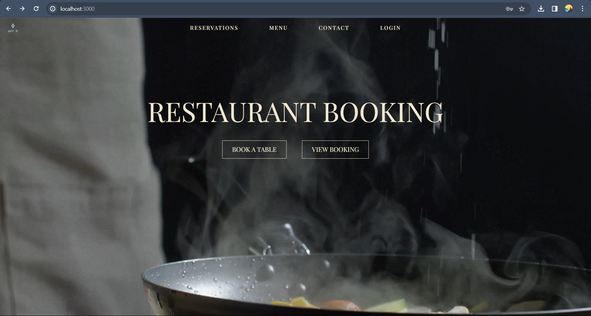

# Restaurant Booking App 📅 🍽️
Fullstack app using React, TypeScript and Styled components on the frontend and Node.js, Express and MongoDB on the backend.

## Table of contents
- [Overview](#overview)
- [Installation](#installation)
- [Testing with Cypress](#testing-with-cypress)
- [Email confirmation setup](#email-confirmation)
- [Access admin](#access-admin)
- [Login credentials](#login-credentials)
- [Screenshots](#screenshots)
- [Tools](#tools)

## Overview
This is a school project where we were tasked to create a restaurant website and booking system using React and TypeScript on the frontend and Node.js, Express and MongoDB on the backend. 

The restaurant has 3 seating each day and 15 tables in total. Each table can seat up to 6 guests. We created functionality to also accommodate larger groups, so the booking system reserves the amount of tables needed. 

The project features full authentication for admin/staff who can log in and perform CRUD operations (access all bookings, add, edit and remove bookings). 

After you make an online reservation, you will receive an email confirmation along with a cancellation link. 

End-to-end tests were implemented using Cypress.

## Screenshots

## Tools
React\
TypeScript\
Sass\
MongoDb\
Node\
Mongoose\
Nodemailer\
Cypress

## Installation
1. Clone the repo\
`git clone https://github.com/imsky003/RestaurantBooking/`

2. Install npm packages\
`npm i`

3. CD into repo\
`cd Restaurant`

4. Create a .env file\
To run this application you'll need the following environment variables in a .env file in the backend folder:\
PORT=4000\
MONGO_URI=”your MongoDB connection string/LA_MERE”

5. Start server\
`cd backend`\
`node app.js`

5. Run React \
Open a new terminal\
`cd frontend`\
`npm start`

## Login Credentials

Login at `"http://localhost:3000/login"`

Admin: `EMAIL: admin@eg.com` - `PASS: admin@123`

